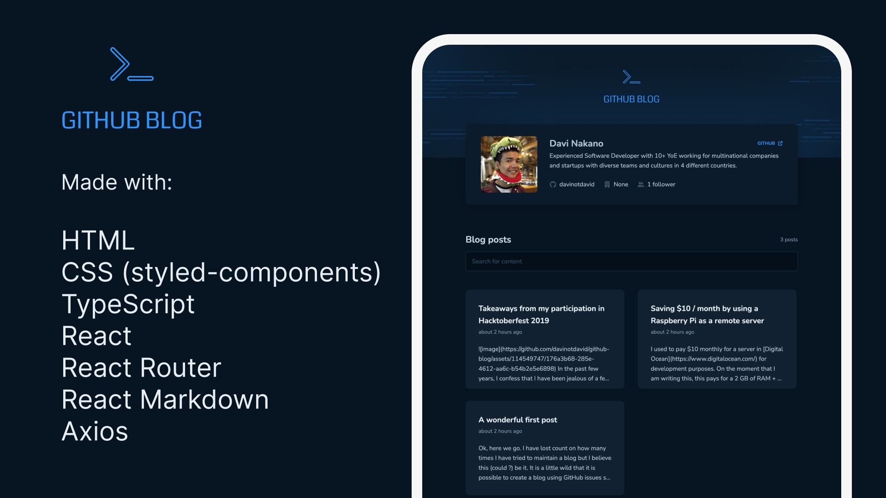

<h1 align="center"> GitHub Blog </h1>

A simple blog that uses this GitHub repo's issues as posts with markdown rendering.

Check it out live <a href="https://github-blog-red-sigma.vercel.app">here</a>!

  <a href="#technologies">Technologies</a>&nbsp;&nbsp;&nbsp;|&nbsp;&nbsp;&nbsp;
  <a href="#project">Project</a>&nbsp;&nbsp;&nbsp;|&nbsp;&nbsp;&nbsp;
  <a href="#learnings">Learnings</a>&nbsp;&nbsp;&nbsp;

  

## Technologies

- HTML
- CSS (styled-components)
- TypeScript
- React
- React Router
- React Markdown
- Axios

## Project

Even though it seems like an unhinged idea, it is possible to leverage GitHub's infrastructure in order to create a simple blog. By considering the repo's issues as posts and its comments as (uh) comments, we can use GitHub's API to query for the data and render it with a blog-y UI.

## Learnings

The whole project idea was an interesting learning experience for me as it encouraged some out-of-the-box thinking and it allowed me to look into existing structures in a different way.

Technically wise, even though I was familiar with the concept of debouncing, it was still somewhat unknown for me how to create a `useDebounce` hook that used TypeScript generics in its type.

There are still quite a bit that can be done to make the project better (not an extensive list):

- Create components for rendering the posts' comments, as well as a CRUD flow for creating comments from within the UI instead of having to go to GH for it.
- Improve the responsive styles
- Create a Context and extract the axios calls outside of the components that use it. Also separate the components a little better for better render performance / avoiding unnecessary re-renders (perhaps using something like [use-context-selector](https://github.com/dai-shi/use-context-selector)).
